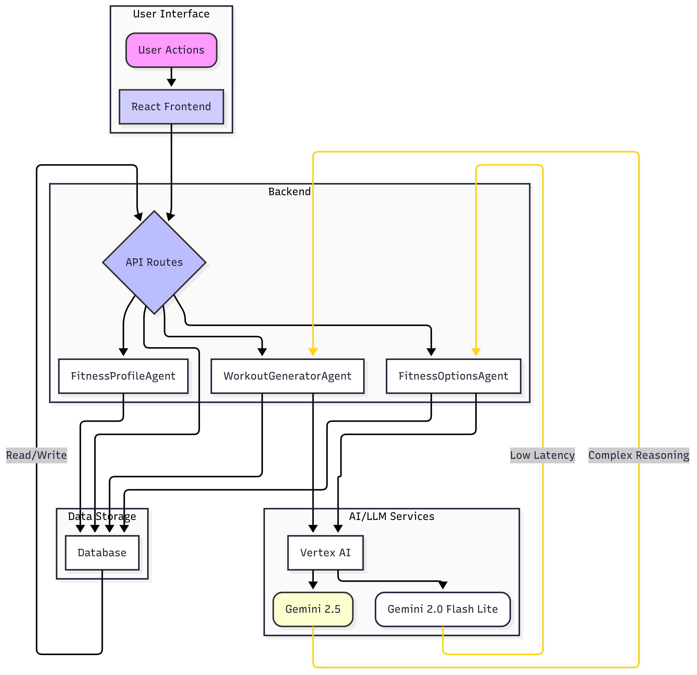

# Personalized Fitness App

This is a full-stack web application that generates personalized fitness plans for users based on their age, goals, and experience level. The backend is built with Flask and the frontend is a React application.

## Application Architecture



This diagram illustrates the high-level architecture of the fitness application, showing the interaction between the frontend, backend services, AI/LLM components, and the database.

## Features

- User profile creation and updates
- Dynamic fitness options based on user's age
- Personalized workout plan generation
- Interactive dashboard to view workout plans
- **AI-Powered Fitness Options**: The Fitness Options API leverages an intelligent agent to dynamically generate personalized fitness options (goals, equipment, workout types, experience levels) based on the user's age and previous selections. This ensures a highly customized onboarding experience.
- **Dynamic Workout Generation**: Once a user's profile is set up, the Workout Generation API utilizes another intelligent agent to create a tailored 3-week workout plan. This plan is dynamically generated based on the user's specific fitness goals, available equipment, preferred workout types, and experience level, providing a truly personalized fitness journey.

- **Interactive Frontend**: A responsive React frontend allows for easy profile setup and management.
- **RESTful API**: A robust Flask backend provides a clear and scalable API for all application services.

## AI/LLM Integration

This application leverages cutting-edge AI and Large Language Models (LLMs) to provide highly personalized experiences:

-   **Google Vertex AI**: The backend agents are deployed and managed on Google Vertex AI, ensuring scalable and robust AI inference.
-   **Gemini 2.5**: Utilized for complex reasoning and generation tasks, such as creating detailed workout plans and nuanced fitness options.
-   **Gemini 2.0 Flash Lite**: Employed for tasks requiring low-latency responses, ensuring a snappy and responsive user experience, especially during interactive fitness option selections.

## Tech Stack

- **Frontend**: React, Vite, `react-router-dom`, Tailwind CSS
- **Backend**: Python, Flask, SQLAlchemy, Alembic, Pydantic, LangChain, Google GenAI

## Project Structure

```
/fitness-app
├── backend/         # Flask API and business logic
│   ├── app/         # Core application files, including routes and agents
│   ├── migrations/  # Database migration scripts
│   ├── run.py       # Application entry point
│   └── requirements.txt
├── src/             # React frontend source code
│   ├── components/  # Reusable React components
│   ├── App.jsx      # Main application component with routing
│   └── main.jsx     # Frontend entry point
├── package.json
└── README.md
```

## Getting Started

### Prerequisites

- Node.js & npm
- Python 3.x & pip

### Backend Setup

1.  **Navigate to the backend directory:**
    ```sh
    cd backend
    ```

2.  **Create and activate a virtual environment:**
    ```sh
    python -m venv venv
    source venv/bin/activate  # On Windows, use `venv\Scripts\activate`
    ```

3.  **Install dependencies:**
    ```sh
    pip install -r requirements.txt
    ```

4.  **Set up environment variables:**
    Copy the example `.env.example` to `.env` and fill in the required values.

5.  **Run database migrations:**
    ```sh
    flask db upgrade
    ```

6.  **Start the backend server:**
    ```sh
    python run.py
    ```

### Frontend Setup

1.  **Navigate to the root directory:**
    ```sh
    cd ..
    ```

2.  **Install dependencies:**
    ```sh
    npm install
    ```

3.  **Start the frontend development server:**
    ```sh
    npm run dev
    ```

The application should now be running and accessible in your browser.

## API Endpoints

The backend exposes the following RESTful endpoints:

- `POST /api/profiles`: Create a new user profile.
- `GET /api/profiles/<uuid>`: Retrieve a user profile by ID.
- `PUT /api/profiles/<uuid>`: Update an existing user profile.
- `POST /api/profiles/<uuid>/workout-plan`: Generate a new workout plan for a user.
- `GET /api/profiles/<uuid>/workout-plan`: Retrieve the latest workout plan for a user.


